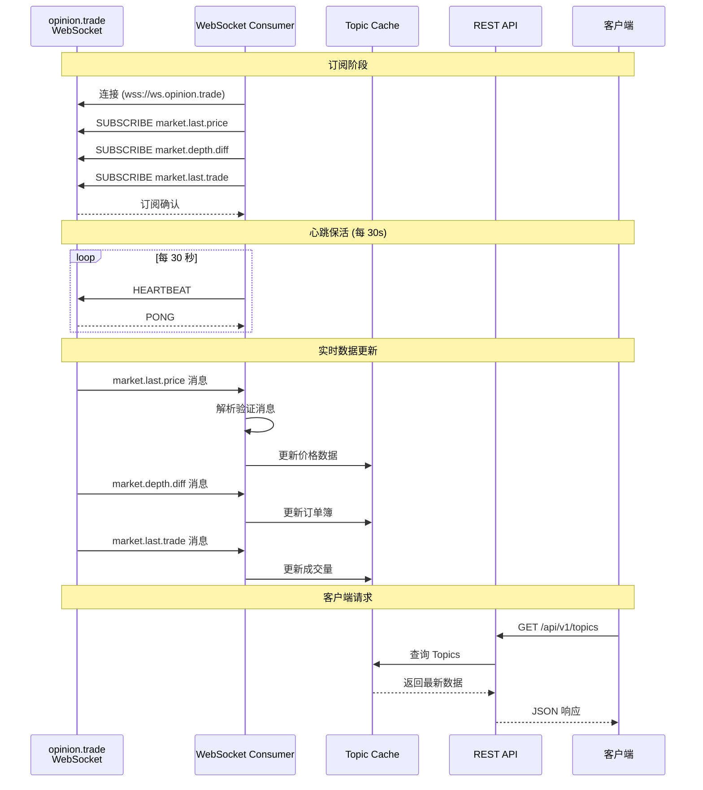
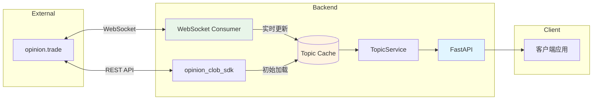

# Opinion Builder Tools - 技术规格文档

## 目录

1. [项目概述](#1-项目概述)
2. [技术栈](#2-技术栈)
3. [项目架构](#3-项目架构)
4. [API 设计](#4-api-设计)
5. [WebSocket 集成](#5-websocket-集成)
6. [数据模型](#6-数据模型)
7. [核心服务设计](#7-核心服务设计)
8. [配置管理](#8-配置管理)
9. [开发规范](#9-开发规范)
10. [部署建议](#10-部署建议)

---

## 1. 项目概述

### 1.1 项目简介
Opinion Builder Tools 是一个帮助用户发现和筛选预测市场（Prediction Market）中感兴趣主题的工具。

### 1.2 项目结构
```
opinion-builder-tools/
├── backend/                 # 后端项目 (Python)
│   ├── opinion_builder/    # 主应用包
│   ├── tests/              # 测试代码
│   ├── pyproject.toml      # 项目配置与依赖管理 (uv)
│   └── uv.lock             # 依赖锁文件
├── frontend/               # 前端项目 (待开发)
└── docs/                   # 项目文档
```

### 1.3 核心功能
1. **Topic 发现**: 通过 opinion_clob_sdk 拉取预测网站的 topics 列表
2. **关键词搜索**: 提供通过关键字搜索 topic 的 API
3. **高级筛选**: 提供通过 end date 等条件过滤 topic 的 API
4. **实时更新**: 通过 WebSocket 保持 topic 数据最新

---

## 2. 技术栈

### 2.1 后端技术栈
| 类别 | 技术选型 | 说明 |
|------|---------|------|
| 语言 | Python 3.12+ | 主开发语言 |
| 包管理 | uv | 快速的 Python 包管理器 |
| Web 框架 | FastAPI | 高性能异步 Web 框架 |
| WebSocket | websocket-client | 连接 opinion.trade WebSocket |
| SDK | opinion_clob_sdk | 预测市场数据获取 |
| 数据验证 | Pydantic | 数据验证与序列化 |
| 异步运行时 | asyncio | 异步任务处理 |

### 2.2 为什么选择 uv
- **性能**: 比 pip 快 10-100 倍
- **依赖解析**: 使用 Rust 实现，解析速度快且准确
- **锁文件**: uv.lock 确保 CI/CD 环境依赖一致性
- **兼容性**: 兼容 pip 的标准工具链

---

## 3. 项目架构

### 3.1 分层架构

```mermaid
graph TB
    subgraph "API Layer"
        A[FastAPI<br/>/api/v1/topics]
        B[/api/v1/topics/search]
        C[POST /api/v1/topics/filter]
        D[/health]
    end

    subgraph "Service Layer"
        E[TopicService]
        F[FilterService]
        G[SearchService]
    end

    subgraph "Data Layer"
        H[opinion_clob_sdk]
        I[(In-Memory Cache)]
    end

    subgraph "WebSocket Layer"
        J[WebSocket Consumer]
        K[opinion.trade WS]
    end

    A --> E
    B --> G
    C --> F
    D --> E
    D --> J

    E --> H
    E --> I
    F --> I
    G --> I

    J --> K
    J --> I
    K -.->|实时更新| I

    style A fill:#e1f5ff
    style B fill:#e1f5ff
    style C fill:#e1f5ff
    style D fill:#e1f5ff
    style I fill:#fff4e1
    style J fill:#e8f5e9
    style K fill:#fce4ec
```

### 3.2 WebSocket 数据流



### 3.3 系统交互图



---

## 4. API 设计

### 4.1 API 基本信息

- **Base URL**: `http://localhost:8000`
- **API 版本**: v1 (路径前缀 `/api/v1`)
- **数据更新方式**: Topics 数据通过 WebSocket 从 opinion.trade 实时更新

> **交互式文档**:
> - Swagger UI: `http://localhost:8000/docs`
> - ReDoc: `http://localhost:8000/redoc`
> - OpenAPI Schema: `http://localhost:8000/openapi.json`

### 4.2 API 端点列表

| 方法 | 路径 | 说明 |
|------|------|------|
| `GET` | `/api/v1/topics` | 获取 Topics 列表 (支持分页、筛选、排序) |
| `GET` | `/api/v1/topics/{topic_id}` | 获取单个 Topic 详情 |
| `GET` | `/api/v1/topics/search` | 关键词搜索 Topics |
| `POST` | `/api/v1/topics/filter` | 高级筛选 Topics |
| `GET` | `/health` | 健康检查 (含 WebSocket 状态) |

### 4.3 筛选参数

**通用筛选** (Topics API):
- `limit`: 返回数量 (最大 200)
- `offset`: 分页偏移量
- `end_date_before` / `end_date_after`: 结束日期范围
- `order_by`: 排序字段 (end_date, created_at, volume, last_price)
- `order`: 排序方向 (asc, desc)

**搜索参数** (Search API):
- `q`: 搜索关键词 (必填)
- `limit`: 返回数量 (最大 100)
- `fuzzy`: 是否模糊匹配

**高级筛选** (Filter API Request Body):
```json
{
  "filters": {
    "end_date_range": {"start": "...", "end": "..."},
    "outcome_types": ["binary", "scalar"],
    "categories": ["crypto", "sports"],
    "keywords": ["Bitcoin"],
    "exclude_keywords": ["meme"],
    "price_range": {"min": "0.5", "max": "0.9"}
  },
  "sort": {"field": "end_date", "order": "asc"},
  "pagination": {"limit": 50, "offset": 0}
}
```

### 4.4 错误处理

**HTTP 状态码:**

| 状态码 | 说明 |
|--------|------|
| 200 | 请求成功 |
| 400 | 请求参数错误 |
| 404 | 资源不存在 |
| 422 | 请求体验证失败 |
| 429 | 请求频率限制 |
| 500 | 服务器内部错误 |
| 503 | 服务暂时不可用 |

**错误代码:** `INVALID_PARAMETER`, `MISSING_PARAMETER`, `NOT_FOUND`, `SDK_ERROR`, `CACHE_ERROR`, `WEBSOCKET_ERROR`, `RATE_LIMIT_EXCEEDED`

### 4.5 快速测试

```bash
# 获取 Topics
curl "http://localhost:8000/api/v1/topics?limit=10"

# 搜索
curl "http://localhost:8000/api/v1/topics/search?q=Bitcoin"

# 健康检查
curl "http://localhost:8000/health"
```

---

## 5. WebSocket 集成

### 5.1 opinion.trade WebSocket 规格

**WebSocket URL:**
```
wss://ws.opinion.trade?apikey={API_KEY}
```

**心跳保活:**
- 每 30 秒发送一次 `HEARTBEAT` 消息
- 保持连接活跃

**订阅频道:**

| 频道 | 用途 | 说明 |
|------|------|------|
| `market.depth.diff` | 订单簿变化 | 订单簿有新/取消/成交时推送 |
| `market.last.price` | 最新价格 | 价格变化时推送 |
| `market.last.trade` | 最新成交 | 有成交时推送 |

**订阅消息格式:**
```json
// Binary Market
{"action":"SUBSCRIBE","channel":"market.last.price","marketId":1274}

// Categorical Market
{"action":"SUBSCRIBE","channel":"market.last.price","rootMarketId":61}
```

**取消订阅:**
```json
{"action":"UNSUBSCRIBE","channel":"market.last.price","marketId":1274}
```

### 5.2 消息示例

**market.depth.diff 消息:**
```json
{
  "marketId": 2764,
  "tokenId": "19120407572139442221452465677574895365338028945317996490376653704877573103648",
  "outcomeSide": 1,
  "side": "bids",
  "price": "0.2",
  "size": "50",
  "msgType": "market.depth.diff"
}
```

**market.last.price 消息:**
```json
{
  "tokenId": "19120407572139442221452465677574895365338028945317996490376653704877573103648",
  "outcomeSide": 1,
  "price": "0.85",
  "marketId": 2764,
  "msgType": "market.last.price"
}
```

**market.last.trade 消息:**
```json
{
  "tokenId": "19120407572139442221452465677574895365338028945317996490376653704877573103648",
  "side": "Buy",
  "outcomeSide": 1,
  "price": "0.85",
  "shares": "10",
  "amount": "8.5",
  "marketId": 2764,
  "msgType": "market.last.trade"
}
```

### 5.3 实时更新的字段

通过 WebSocket 更新的字段包括：
- `last_price` - 最新成交价格
- `yes_price` / `no_price` - Yes/No 价格
- `volume` - 交易量
- `liquidity` - 流动性
- `updated_at` - 最后更新时间

### 5.4 注意事项

1. **无需手动刷新**: Topics 数据通过 WebSocket 自动保持最新
2. **连接状态**: 可通过 `/health` 端点查看 WebSocket 连接状态
3. **自动重连**: WebSocket 断线后会自动尝试重连
4. **数据延迟**: 正常情况下数据延迟 < 1 秒

### 5.5 WebSocket Consumer 设计

**核心职责：**
- 连接管理：建立和维护 opinion.trade WebSocket 连接
- 订阅管理：订阅所有市场的更新频道
- 心跳保活：每 30 秒发送心跳保持连接
- 消息处理：解析并分发 WebSocket 消息到缓存
- 自动重连：断线后自动重连并重新订阅

---

## 6. 数据模型

### 6.1 Topic 模型

| 字段 | 类型 | 说明 |
|------|------|------|
| `id` | string | Topic 唯一标识 |
| `market_id` | int | 市场 ID (对应 WebSocket 订阅) |
| `question` | string | 预测问题 |
| `description` | string | 详细描述 |
| `end_date` | datetime | 结束时间 |
| `outcome_type` | string | 结果类型 (binary/scalar/categorical) |
| `volume` | decimal | 交易量 |
| `last_price` | string | 最新价格 (WebSocket 实时更新) |
| `yes_price` / `no_price` | string | Yes/No 价格 |
| `liquidity` | string | 流动性 |
| `created_at` / `updated_at` | datetime | 创建/更新时间 |
| `categories` | array | 分类标签 |
| `slug` | string | URL 友好标识 |

### 6.2 筛选模型

**TopicFilter:**
- 日期范围：`end_date_before`, `end_date_after`, `created_after`
- 类型筛选：`outcome_types`, `categories`
- 交易量：`min_volume`, `max_volume`
- 价格：`price_range` (min/max)
- 关键词：`keywords`, `exclude_keywords`

**SortOption:**
- `field`: 排序字段 (end_date, created_at, volume, last_price)
- `order`: 排序方向 (asc, desc)

**Pagination:**
- `limit`: 返回数量 (默认 50，最大 200)
- `offset`: 分页偏移量

### 6.3 WebSocket 消息模型

**消息类型：**

| 消息类型 | 说明 |
|----------|------|
| `market.depth.diff` | 订单簿变化 |
| `market.last.price` | 最新价格 |
| `market.last.trade` | 最新成交 |

**公共字段：**
- `msgType`: 消息类型
- `marketId`: 市场 ID
- `tokenId`: 条件代币 ID
- `outcomeSide`: 结果侧 (1=Yes, 2=No)

---

## 7. 核心服务设计

### 7.1 TopicService

**职责：** Topics 核心业务逻辑

**方法：**
- `get_topics()` - 获取 Topics 列表 (支持筛选、排序、分页)
- `get_topic_by_id()` - 根据 ID 获取单个 Topic
- `search_topics()` - 关键词搜索 (支持模糊匹配)
- `filter_topics()` - 高级筛选

### 7.2 WebSocketService

**职责：** WebSocket 连接管理

**方法：**
- `start()` - 启动连接，订阅所有市场
- `stop()` - 停止连接
- `get_status()` - 获取连接状态
- `subscribe_all_markets()` - 批量订阅

### 7.3 CacheService

**职责：** 内存缓存管理

**数据结构：**
- `topics`: `dict[market_id, Topic]` - 主题存储
- `search_index`: 搜索索引 - 提升搜索性能
- `lock`: 异步锁 - 保证并发安全

**方法：**
- `get_topic()` / `set_topic()` - 单个 Topic 读写
- `get_all_topics()` - 获取全部
- `update_price()` / `update_from_ws_message()` - 实时更新
- `search()` - 搜索 Topics

---

## 8. 配置管理

### 8.1 环境变量

| 分类 | 变量名 | 说明 |
|------|--------|------|
| **API** | `API_HOST`, `API_PORT`, `LOG_LEVEL` | 服务地址、端口、日志级别 |
| **SDK** | `OPINION_SDK_API_KEY`, `OPINION_SDK_BASE_URL` | SDK API 密钥、基础 URL |
| **WebSocket** | `OPINION_WS_API_KEY`, `OPINION_WS_HEARTBEAT_INTERVAL` | WS 密钥、心跳间隔 |
| **缓存** | `CACHE_ENABLED`, `CACHE_MAX_SIZE` | 缓存开关、最大数量 |
| **分页** | `DEFAULT_LIMIT`, `MAX_LIMIT` | 默认/最大返回数量 |

### 8.2 配置加载

使用 `pydantic-settings` 从环境变量和 `.env` 文件加载配置，支持：
- 类型验证和转换
- 默认值设置
- 环境变量优先级

---

## 9. 开发规范

### 9.1 代码风格
- **PEP 8** - Python 代码风格规范
- **ruff** - 代码检查和格式化
- **类型注解** - 使用 Python 3.12+ 新语法

### 9.2 Git 提交规范

遵循 **Conventional Commits**:
```
feat: add topic search API
fix: resolve websocket reconnection bug
docs: update API documentation
refactor: simplify filter service logic
test: add unit tests for topic service
```

### 9.3 测试策略
- **单元测试** - 覆盖核心业务逻辑
- **集成测试** - API 端到端测试
- **Mock** - pytest-mock 处理 SDK 和 WebSocket

### 9.4 项目依赖

**核心依赖:**
- `fastapi` - Web 框架
- `uvicorn` - ASGI 服务器
- `pydantic` / `pydantic-settings` - 数据验证
- `websocket-client` - WebSocket 客户端
- `opinion-clob-sdk` - 预测市场 SDK

**开发依赖:**
- `pytest` / `pytest-asyncio` - 测试框架
- `ruff` - 代码检查
- `httpx` - HTTP 测试客户端

---

## 10. 部署建议

### 10.1 本地开发

```bash
# 安装 uv
pip install uv

# 安装依赖
cd backend && uv sync

# 配置环境变量
cp .env.example .env

# 启动服务
uv run uvicorn opinion_builder.main:app --reload
```

### 10.2 生产部署
- **服务器**: Gunicorn + Uvicorn Workers
- **反向代理**: Nginx
- **进程管理**: Systemd 或 Docker
- **WebSocket**: 后台独立进程运行

### 10.3 后续扩展
1. **数据持久化**: PostgreSQL/MongoDB
2. **用户个性化**: 订阅和推荐
3. **前端**: React/Vue
4. **多数据源**: Polymarket, Kalshi

---

## 参考资料

- [Opinion WebSocket - Quickstart](https://docs.opinion.trade/developer-guide/opinion-websocket/quickstart)
- [Opinion WebSocket - Market Channels](https://docs.opinion.trade/developer-guide/opinion-websocket/market-channels)
